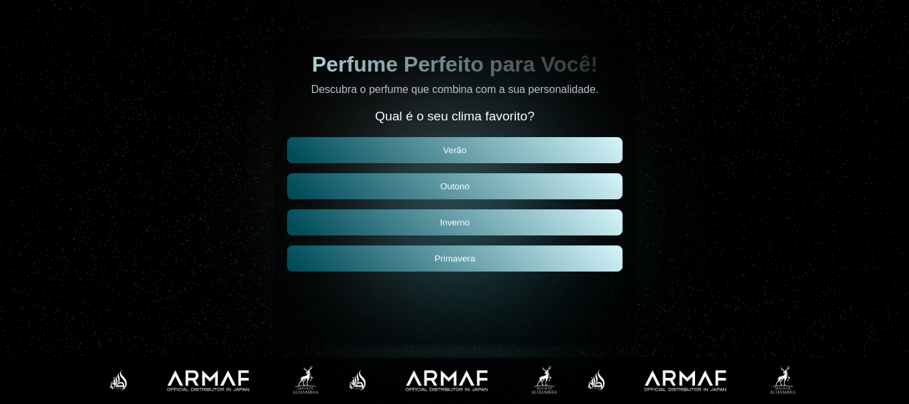

# Meu Site de Quiz Interativo

Este repositório contém um site de quiz interativo, com interface responsiva e um layout adaptável para diferentes dispositivos, como desktop e mobile.

## Demonstração

Você pode ver o site em funcionamento no seguinte link:

[**Visite o site**](https://Eduardochimchek.github.io/PerfumeQuizzDemo)

Aqui está uma captura de tela da interface:

## Funcionalidades

- **Interface Responsiva**: O site é adaptável a diferentes tamanhos de tela, incluindo dispositivos móveis.
- **Quiz Interativo**: A página apresenta um quiz onde os usuários podem responder a perguntas.
- **Design Limpo**: O layout foi projetado para ser simples e intuitivo.

## Como Rodar Localmente

### 1. Clone este repositório:

git clone https://github.com/Eduardochimchek/PerfumeQuizzDemo.git

### 2. Navegue até o diretório do projeto:

cd PerfumeQuizzDemo

### 3. Abra o arquivo index.html no seu navegador:

O site será carregado localmente diretamente a partir do arquivo HTML.

## Tecnologias Usadas

HTML5 | CSS3 | JavaScript

## Contribuindo

Se você quiser contribuir para o projeto, siga estas etapas:

Faça um fork deste repositório. 
Crie uma branch para a sua feature (git checkout -b feature/nome-da-feature). 
Faça commit das suas mudanças (git commit -am 'Adiciona nova feature'). 
Envie para o repositório remoto (git push origin feature/nome-da-feature). 
Abra um pull request.

## Licença

Este projeto está licenciado sob a Licença MIT.
